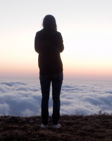

#Lea Zouein CV

**THE POSTOFFICE**
Online Editor / Junior Compositor August 2017 - October 2020

Working with the Postoffice taught me several skills:

Multi-tasking and work on several softwares and tasks
Great attention to detail
Handling dailies
Workflow from start to finish(from asset hand-off to final content delivery)
Resolving client issues, providing solutions
Perfect knowledge of digital media : codecs, image types, resolutions, frame rates
Video metadata and transcription
Compositing on Flame 
Tracking
Rotoscoping
Package replacement
Keying
Beauty retouching
Paint out
Conforming insuring highest quality used with metadata
Excellent understanding of color range and color spaces principles
Ability to quickly adapt and learn new technologies and softwares
2D animation

Projects:
Capharnaum - Nadine labaki
Still Recording - Saeed Al Batal - Ghiath Ayoub
State Of Agitation Elie khalife
Ghassan Halwani erased, Ascent of the invisible
Ghassan Salhab la riviere
Shades Of Politics - Rania Rafei
Beirut Hold’em - Michel Kammoun
Insomnia of a serial dreamer - Mohamed Soueid

**MOONSHOT / SOHA SHUKAYR**
Junior Video Editor / October 2016 - June 2017

My role as a junior video editor taught me several editing skills. I was Abe to maintain deadlines by being time efficient. I learnt how to sync, organise projects, go through the selection process, and eventually create rough-cuts.
The work ranged from music videos to documentaries, corporate event videos, daily episodes and wedding videos.
One of the most recent projects I had the opportunity to work on was “Helwet Ramadan” for Make Up Forever.

**MOONSHOT / SOHA SUKAYR**
Internship Junior Video Editor / August 2016 - October 2016

As an intern in a post-production company, I was introduced to editing as professional career option. Working side by side with the editor allowed me to learn several visual and technical skills.

**MAQAMAT BEIT EL-RAQS**
Coordinator / June - August 2016
As  the coordinator of TAKWEEN 2016 Dance Program, I handled the planning of the festival from event organisation to production. My role allowed me to grow on both professional and personal levels.

**MAQAMAT BEIT EL-RAQS**
Props Manager - Production Assistant / March - May 2016

Working on Bipod Dance Festival was an enriching experience as I took part in all aspects of the festival’s production. I learnt to work under pressure, manage my time properly, and handles urgent situations. It also allowed me to develop social and organisational skills.

**EDUCATION**

Université Saint-Joseph
Audiovisual 2015

The curriculum provided a comprehensive education through a range of theoretical and practical courses tackling various film challenges.

**SKILLS**

Softwares: Final Cut, Avid Media Composer, Adobe Premiere, Assimilate Scratch, Autodesk Flame, Davinci Resolve

Skill-Set: Video Editing, Comforming, Compositing, 2D animation, keying, tracking, rotoscoping.

**LANGUAGES**

I’m fluent in English, French and Arabic.

**INTERESTS**

Film, Sound, Photography, Video Making, Reading, Wood Work, Japanese Culture

